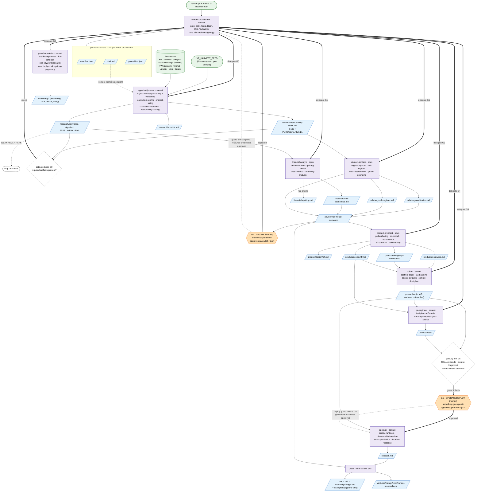

# Venture-factory — agent / skill / I-O flow

How each agent uses its skills and what artifacts flow in and out, across the gated lifecycle
`G0 → G1 → **G2 (human)** → G3 → G4 → G5 → **G6 (human)** → Retro`.

- **Agents** (purple) own a gate and delegate-receive from the orchestrator. Each lists the skills it runs.
- **Artifacts** (blue parallelograms) are files under `ventures/<slug>/`. The orchestrator is the **single writer** of `manifest.json`, `brief.md`, and `gates/`.
- **Sources** (green) are external inputs. **Human gates** (orange hexagons) and deterministic **gate checks** (dashed diamonds) are where the factory stops or enforces.

## Legend
| shape | meaning |
|---|---|
| purple rounded | agent (with model + the skills it runs) |
| blue parallelogram | artifact written under `ventures/<slug>/` |
| green stadium / cylinder | external input (human goal, seed, live sources) |
| orange hexagon | **human gate** — orchestrator stops, never self-approves |
| dashed diamond | deterministic check in `.claude/hooks/gate.py` |
| thick arrow `==>` | orchestrator delegate / gate-pass control flow |
| solid arrow `-->` | artifact/data flows in or out |
| dotted arrow `-.->` | conditional / mode-specific / guard relationship |

> The orchestrator is the only writer of `manifest.json`, `brief.md`, and `gates/`; specialists write only inside their own folder (`research/`, `advisory/`, `financials/`, `product/`, `marketing/`, `runbook.md`). The model can never write `gates/*.json` — only `gate.py` or a human can.
